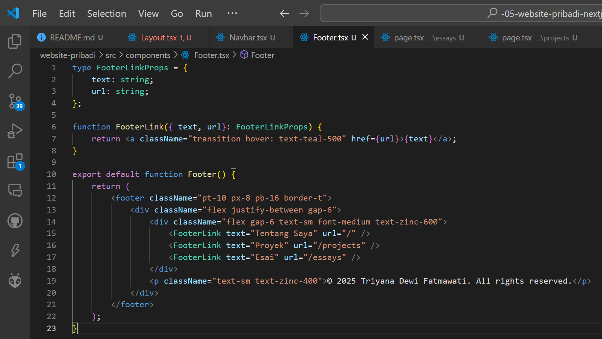

This is a [Next.js](https://nextjs.org) project bootstrapped with [`create-next-app`](https://nextjs.org/docs/app/api-reference/cli/create-next-app).

## Getting Started

First, run the development server:

```bash
npm run dev
# or
yarn dev
# or
pnpm dev
# or
bun dev
```

Open [http://localhost:3000](http://localhost:3000) with your browser to see the result.

You can start editing the page by modifying `app/page.tsx`. The page auto-updates as you edit the file.

This project uses [`next/font`](https://nextjs.org/docs/app/building-your-application/optimizing/fonts) to automatically optimize and load [Geist](https://vercel.com/font), a new font family for Vercel.

## Learn More

To learn more about Next.js, take a look at the following resources:

- [Next.js Documentation](https://nextjs.org/docs) - learn about Next.js features and API.
- [Learn Next.js](https://nextjs.org/learn) - an interactive Next.js tutorial.

You can check out [the Next.js GitHub repository](https://github.com/vercel/next.js) - your feedback and contributions are welcome!

## Deploy on Vercel

The easiest way to deploy your Next.js app is to use the [Vercel Platform](https://vercel.com/new?utm_medium=default-template&filter=next.js&utm_source=create-next-app&utm_campaign=create-next-app-readme) from the creators of Next.js.

Check out our [Next.js deployment documentation](https://nextjs.org/docs/app/building-your-application/deploying) for more details.

---

# Laporan Praktikum Membangun Website Pribadi dengan Next.js (App Router), React, dan Tailwind CSS 

|  | Pemrograman Berbasis Framework 2025 |
|--|--|
| NIM |  2241720206 |
| Nama |  Triyana Dewi Fatmawati |
| Kelas | TI - 3D |


## Langkah-langkah Praktikum
### 1. Persiapan Lingkungan
1. Pastikan Node.js dan npm sudah terinstal di komputer Anda. Anda dapat memeriksanya dengan menjalankan perintah berikut di terminal atau command prompt: <br>


2. Buat direktori baru untuk proyek Next.js Anda: <br>
 <br>


3. Inisialisasi proyek Next.js dengan TypeScript dan App Router: <br>**npx create-next-app@latest . --typescript –app**<br>


4. Cek konfigurasi postcss.config.mjs: <br>


5. Cek di app/globals.css, sudah ada import untuk tailwindcss: <br>


6. Buka app/layout.tsx, tambahkan import './globals.css', dan modifikasi menjadi sebagai berikut: <br>


7. Jalankan aplikasi Next.js: <br>
<br>
Aplikasi akan terbuka di browser pada alamat http://localhost:3000. Namun pada praktikum ini hasilnya masih error<br>


---

### 2. Membuat Halaman Website 
Website pribadi akan memiliki tiga halaman: 
- **Tentang Saya**: Halaman berisi profil singkat dan link ke media sosial. 
- **Proyek**: Halaman untuk menampilkan proyek-proyek yang telah diselesaikan. 
- **Esai**: Halaman untuk menampilkan daftar artikel yang telah ditulis. <br>

**Langkah-langkah:** <br>
1. Buat file app/page.tsx sebagai halaman "Tentang Saya": <br>


2. Buat file app/projects/page.tsx sebagai halaman "Proyek": <br>


3. Buat file app/essays/page.tsx sebagai halaman "Esai": <br>


4. Buka browser dan akses: 
    Hasil awalnya memang error, namun setelah dibuat file Layout.tsx hasilnya seperti berikut: <br>
    - http://localhost:3000/ untuk halaman "Tentang Saya". <br>
     
    - http://localhost:3000/projects untuk halaman "Proyek". <br>
    
    - http://localhost:3000/essays untuk halaman "Esai". <br>
    
---

### 3. Membuat Layout dan Navigasi 
Layout digunakan untuk menyediakan struktur yang konsisten di seluruh halaman, seperti navbar dan footer. <br>
**Langkah-langkah:**
1. Buat direktori src/components jika belum ada. <br>

2. Buat file src/components/Layout.tsx <br>


3. Buat file src/components/Navbar.tsx <br>


4. Buat file src/components/Footer.tsx <br>


5. Update file app/layout.tsx untuk menggunakan layout: <br>


6. Update setiap halaman menambahkan metadata dengan generateMetadata: <br>
<br>
Lakukan hal yang sama untuk halaman projects/page.tsx dan essays/page.tsx.<br>
 
<br>
<br>

- **Hasil Tampilan Halaman "Tentang Saya"** <br>
 <br> 
- **Hasil Tampilan Halaman "Proyek"** <br>
 <br>
- **Hasil Tampilan Halaman "Esai"** <br>
 

---

### 4. Membuat Halaman Proyek dengan Grid Responsif 
Halaman proyek akan menampilkan daftar proyek dalam bentuk grid yang responsif. 
Langkah-langkah: 
1. Buat folder di public/images. Kemudian tambahkan dua image, lalu rename dengan nama **project1.png** dan **project2.png** <br>


2. Modifikasi file app/projects/page.tsx: <br>
Tambahkan import next/image dan beberapa image yang telah ditambahkan sebelumnya <br>
<br>
Buat card project item sebagai berikut:<br>
<br>
Modifikasi komponen project sebagai berikut: <br>

 
3. Simpan file dan buka http://localhost:3000/projects di browser. Anda akan melihat daftar proyek dalam grid yang responsif. <br>


---

## Tugas 
Eksplorasi Tailwindcss, kemudian. 
1. Modifikasi halaman "Esai" dengan Grid daftar artikel yang telah ditulis. <br>

2. Modifikasi halaman “Tentang Saya” Buat tampilan yang menarik <br>

---

## Kesimpulan 
Dalam praktikum ini, telah dipelajari cara membangun website pribadi menggunakan Next.js (App Router), React, dan Tailwind CSS. Selain itu, juga telah mengimplementasikan fitur-fitur seperti routing, layout, serta komponen reusable. 

---

**Referensi** 
- Dokumentasi Resmi Next.js: https://nextjs.org/docs 
- Dokumentasi Tailwind CSS: https://tailwindcss.com/docs